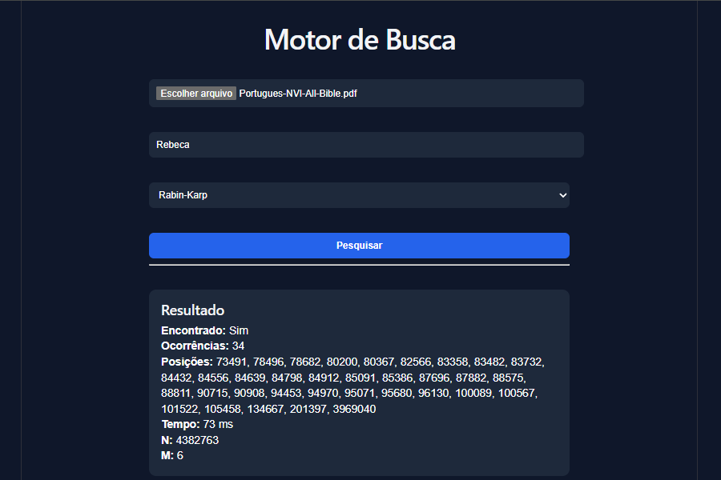
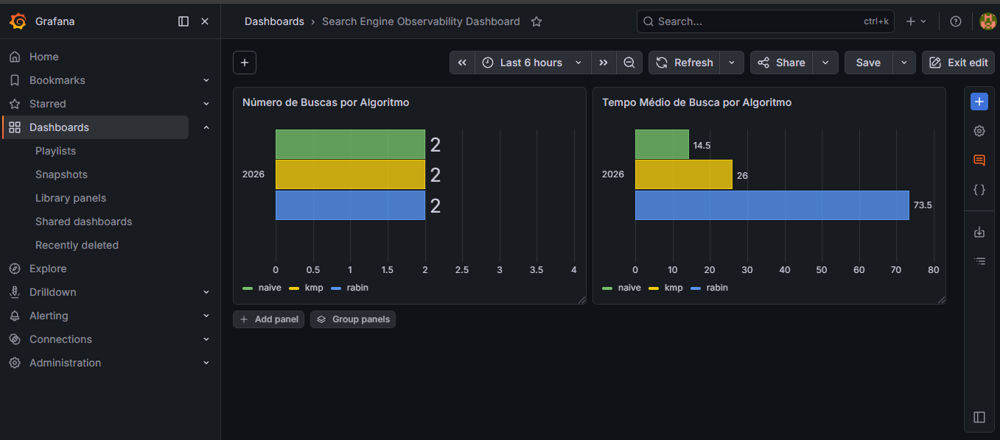
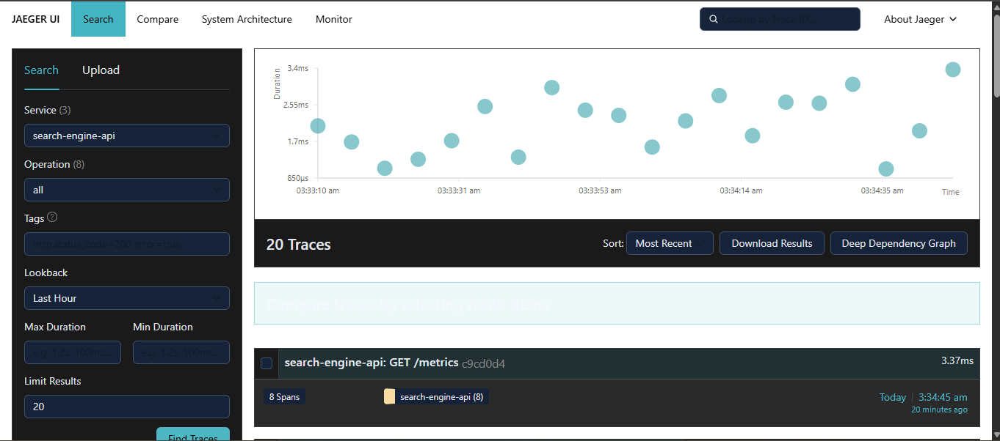

# 🔎 Motor de Busca em Documentos

Motor de busca em documentos utilizando algoritmos avançados de substring search com observabilidade usando OpenTelemetry, Prometheus, Jaeger e Grafana.

---

## 📚 Sobre o Projeto

Este projeto foi desenvolvido para a disciplina de Algoritmos Avançados.

A aplicação permite realizar buscas de palavras ou trechos em documentos TXT e PDF utilizando diferentes algoritmos de busca de substring, possibilitando comparação de desempenho entre eles através de métricas e dashboards de observabilidade.

---

## 👨‍💻 Integrantes

- Rebeca Lara de Souza

---

## 🚀 Funcionalidades

✅ Upload de arquivos TXT  
✅ Upload de arquivos PDF (bônus)  
✅ Busca de palavras e trechos  
✅ Seleção dinâmica do algoritmo de busca  
✅ Exibição de:

- encontrado / não encontrado
- número de ocorrências
- posições encontradas
- tempo de execução
- tamanho do texto (N)
- tamanho do padrão (M)

✅ Dashboard de observabilidade  
✅ Métricas Prometheus  
✅ Traces com OpenTelemetry  
✅ Visualização com Grafana e Jaeger  

---

## 📸 Interface da Aplicação

```md

```

---

## 🧠 Algoritmos Implementados

### ✅ Naive Search (Força Bruta)

Busca simples comparando caractere por caractere.

Complexidade:

```text
O(N * M)
```

---

### ✅ KMP (Knuth-Morris-Pratt)

Utiliza tabela de falhas para evitar comparações desnecessárias.

Complexidade:

```text
O(N + M)
```

---

### ✅ Rabin-Karp

Utiliza hash rolante para acelerar comparações.

Complexidade esperada:

```text
O(N + M)
```

---

## 🏗️ Arquitetura

O projeto utiliza o padrão:

### ✅ Strategy Pattern

Cada algoritmo foi implementado como uma estratégia independente, permitindo troca dinâmica em tempo de execução através da interface.

---

## 🖥️ Tecnologias Utilizadas

### Frontend
- React
- Vite

### Backend
- Node.js
- Express

### Observabilidade
- OpenTelemetry
- Jaeger
- Prometheus
- Grafana

### Outras bibliotecas
- multer
- pdf-parse
- prom-client

---

## 📂 Estrutura do Projeto

```text
search-engine-project/
│
├── backend/
│   ├── metrics/
│   ├── routes/
│   ├── strategies/
│   ├── telemetry/
│   ├── uploads/
│   └── server.js
│
├── frontend/
│   ├── src/
│   ├── package.json
│   └── vite.config.js
│
├── .gitignore
├── docker-compose.yml
├── prometheus.yml
└── README.md
```

---

## ⚙️ Como Executar

### 1️⃣ Clonar o repositório

```bash
git clone <URL_DO_REPOSITORIO>
```

---

### 2️⃣ Backend

```bash
cd backend
npm install
npm run dev
```

Backend disponível em:

```text
http://localhost:3000
```

---

### 3️⃣ Frontend

```bash
cd frontend
npm install
npm run dev
```

Frontend disponível em:

```text
http://localhost:5173
```

---

### 4️⃣ Observabilidade

Na raiz do projeto:

```bash
docker compose up -d
```

---

## 📊 Serviços de Observabilidade

### Jaeger

```text
http://localhost:16686
```

### Prometheus

```text
http://localhost:9090
```

### Grafana

```text
http://localhost:3001
```

Login padrão Grafana:

```text
user: admin
password: admin
```

---

## 📈 Dashboard

O dashboard desenvolvido no Grafana exibe:

✅ Número de buscas realizadas por algoritmo  
✅ Tempo médio de busca por algoritmo  
✅ Comparação visual entre algoritmos  

---

## 📸 Dashboard Grafana

```md

```

---

## 🔍 OpenTelemetry

A aplicação foi instrumentada com OpenTelemetry para coleta de:

### Traces
- requisições de busca
- execução dos algoritmos

### Métricas
- tempo de execução
- quantidade de buscas

### Logs
- algoritmo utilizado
- tamanho do texto
- tamanho do padrão
- tempo de execução
- número de ocorrências

---

## 📸 Jaeger Traces

```md

```

---

## 📝 Logs

A aplicação registra logs contendo:

- Algoritmo utilizado
- Tamanho do texto (N)
- Tamanho do padrão (M)
- Tempo de execução
- Número de ocorrências
- Posições encontradas

---

## 📄 Suporte a Arquivos

### TXT
Suporte completo obrigatório.

### PDF
Implementado como funcionalidade bônus.

---

## 🧪 Testes

Os testes principais foram realizados utilizando documentos extensos para avaliação de desempenho dos algoritmos, incluindo textos longos como a Bíblia em TXT/PDF.

---

## 🤖 Uso de IA

Foi utilizado ChatGPT como ferramenta de apoio para:

- esclarecimento de dúvidas
- integração entre ferramentas
- auxílio na implementação
- correção de erros
- aprendizado sobre observabilidade